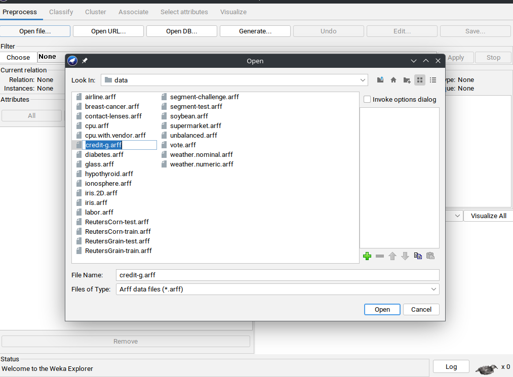
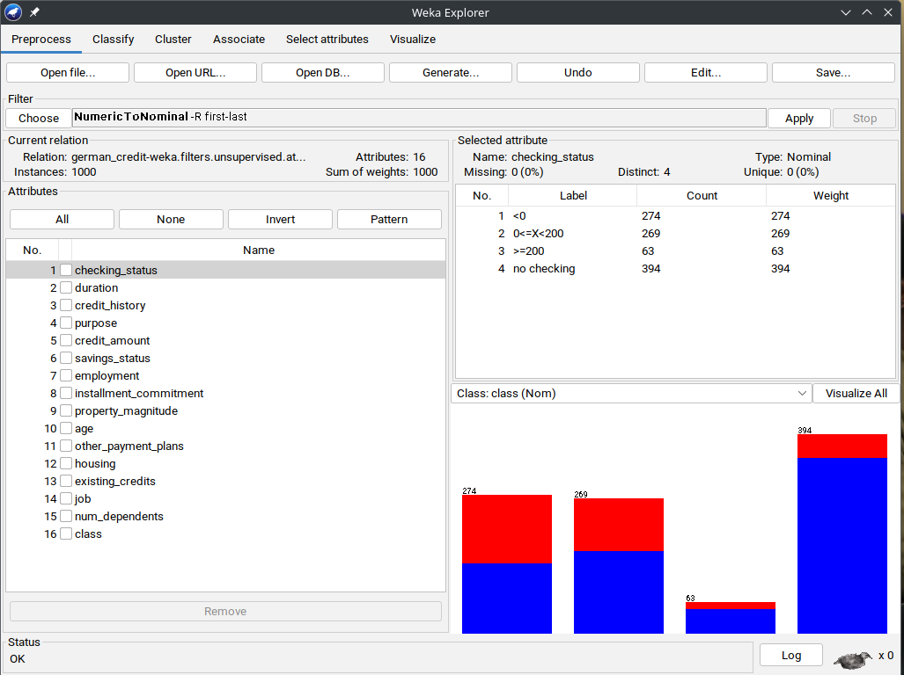
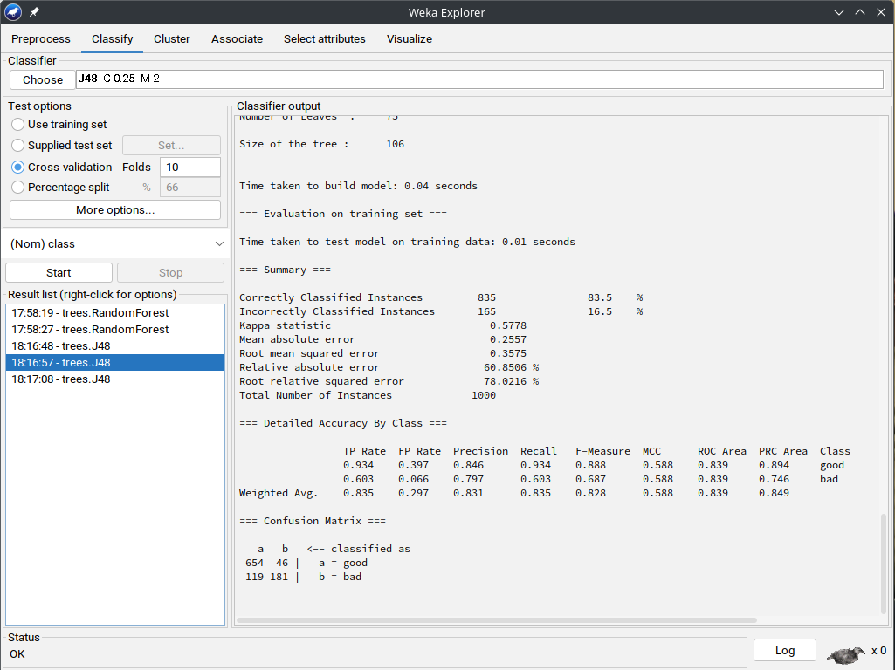
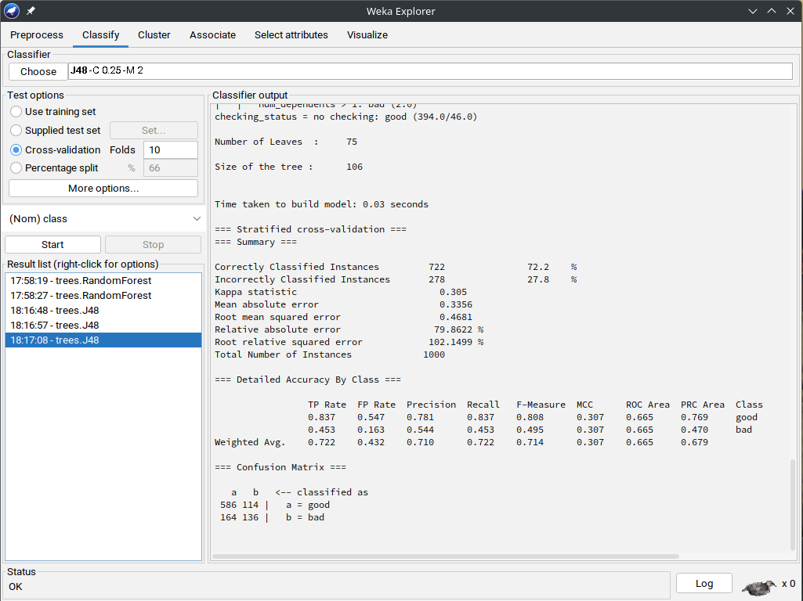
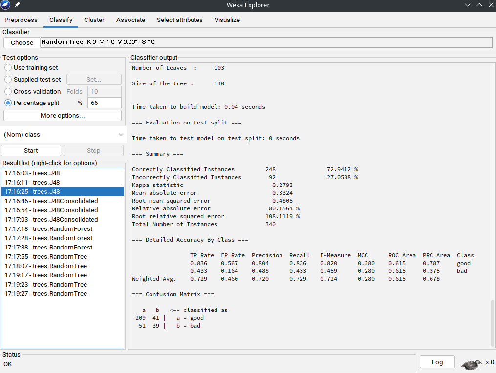
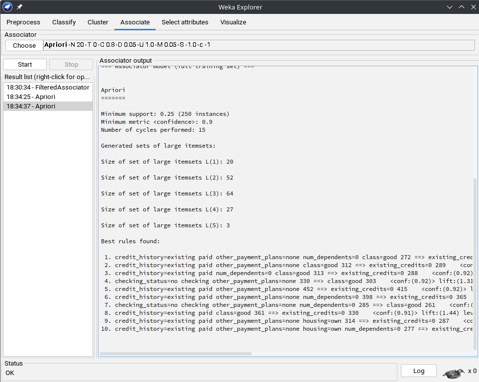

# Cat 2: Using WEKA to Analyze Loan Eligibility Status for Customers  

## Data Source  

The data used is from the WEKA installation in the data folder.  [link](/credit-g.arff)

  

To use the Apriori algorithm, we first need to convert numerical data into nominal form.  

  

After conversion, we classify the data using the **Random Tree** algorithm. It offers a balance between simplicity and performance in machine learning tasks, particularly for decision-making processes like loan approval.  

### Why Random Tree?  
- Handles large datasets efficiently.  
- Works well with noisy or incomplete data.  

## Classification Outcomes  

| Test Option                  | Outcome Preview |
|------------------------------|----------------|
| **J48 using Training set**    |  |
| **J48 using Cross-Validation** |  |
| **J48 using Percentage Split** |  |

### Outcome Evaluation  

The J48 Decision Tree classifier achieved **72.2% accuracy** on stratified cross-validation and **73.2% accuracy** on the test set.  

| Metric             | Cross-Validation | Test Set  |
|--------------------|-----------------|-----------|
| **Accuracy**      | 72.2%            | 73.2%     |
| **Kappa Statistic** | 0.305            | 0.2949    |
| **Precision (Good)** | 78.1%            | 80.9%     |
| **Recall (Good)** | 83.7%            | 83.2%     |
| **Precision (Bad)** | 54.4%            | 49.4%     |
| **Recall (Bad)** | 45.3%            | 45.6%     |

### Observations  
- The model is better at predicting **'Good'** loans (**83.7% recall**) than **'Bad'** loans (**45.3% recall**).  
- False positives are a concern (**54.7% of 'Bad' loans were misclassified as 'Good'**).  
- The **Kappa statistic (0.305)** suggests moderate agreement between predictions and actual classifications.  

## Association Rule Mining with Apriori  

  

### Key Findings from Apriori Rules:  

- **credit_history=existing paid → existing_credits=0**  
  - **Confidence: 90%** → Very strong!  
  - **Lift: 1.42** → This relationship is meaningful.  

- Many rules relate to **num_dependents=0**:  
  - **job=skilled** → 87% of skilled workers have **0 dependents**.  
  - **housing=own** → 85% of homeowners have **0 dependents**.  

- Other high-confidence patterns include:  
  - **other_payment_plans=none & class=good → num_dependents=0** (**85% confidence**)  
  - **existing_credits=0 → num_dependents=0** (**87% confidence**)  

## Data warehousing, OLTP, OLAP, and business intelligence in banking industry 

### Data Warehousing  
Data warehousing centralizes and integrates data from multiple sources, enabling banks to:  
- Store **historical transaction data** for in-depth analysis.  
- Improve **data consistency and integrity** across branches.  
- Support **business intelligence (BI) and reporting** for decision-making.  
- Enable **predictive modeling** for risk assessment and loan approvals.  

A data warehouse aggregates information from **OLTP systems, customer interactions, credit history databases, and financial transactions**, providing a **unified view** of banking operations.  

### OLTP (Online Transaction Processing) Systems  
**OLTP systems** handle real-time transaction processing, ensuring:  
- **High-speed data processing** for banking transactions (e.g., deposits, withdrawals, loan applications).  
- **Concurrency control**, allowing multiple users to access and modify data simultaneously.  
- **Data integrity and consistency**, ensuring accurate records for compliance and auditing.  
- **Minimal downtime**, ensuring 24/7 availability for financial services.  

Example: When a customer **applies for a loan online**, the OLTP system processes the request, verifies credit history, and updates account records in real time.  

 

### OLAP (Online Analytical Processing) Systems  
**OLAP systems** enable banks to analyze large datasets through **multidimensional analysis** and **complex queries**, allowing for:  
- **Risk assessment** by evaluating loan repayment trends across different demographics.  
- **Fraud detection** by identifying unusual transaction patterns.  
- **Customer segmentation** based on spending behavior and creditworthiness.  
- **Performance tracking** of loan officers and banking services.  

Example: An OLAP system can help identify that **customers aged 30-45 with high credit scores have a 95% repayment rate**, guiding future loan approval strategies.  

 
### Business Intelligence (BI) Trends in Banking  
Recent BI trends are transforming banking analytics:  

1. **Self-Service BI** – Allows bank employees to generate reports and insights **without needing IT specialists**.  
2. **AI-Driven Analytics** – Uses machine learning for **predicting loan defaults** and **personalized financial recommendations**.  
3. **Real-Time Analytics** – Enables instant decision-making for **fraud detection** and **credit scoring**.  
4. **Cloud-Based BI** – Improves scalability and remote access to banking analytics.  

**Example:** AI-driven BI tools can **automatically flag risky loan applications**, reducing manual review time.  

### Predictive Analytics Software & Service Providers  
Several tools enhance predictive modeling and decision-making in banking:  

| Software | Key Features |
|----------|-------------|
| **IBM SPSS** | Advanced statistical analysis, machine learning, and predictive modeling for credit risk assessment. |
| **SAS Advanced Analytics** | Robust data mining, AI-driven fraud detection, and real-time decision-making support. |
| **Alteryx** | Low-code analytics platform integrating data preparation, predictive modeling, and automation. |

By leveraging **predictive analytics**, banks can:  
- **Improve loan approval accuracy** by identifying high-risk applicants.  
- **Detect fraud in real time** using anomaly detection.  
- **Personalize banking offers** based on customer behavior analysis.  

