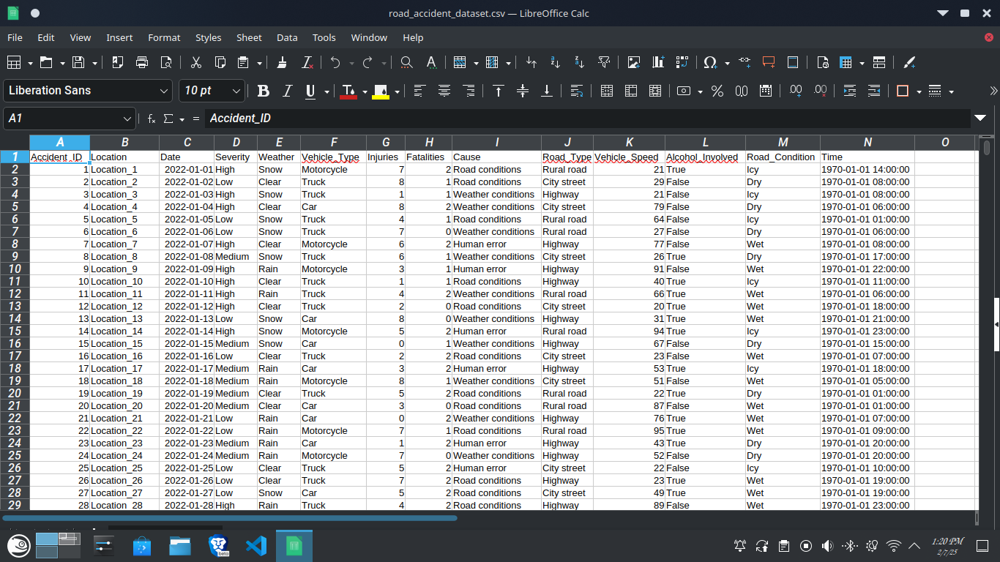
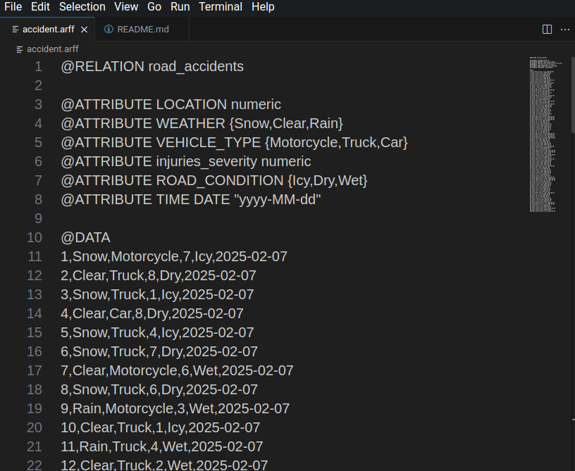
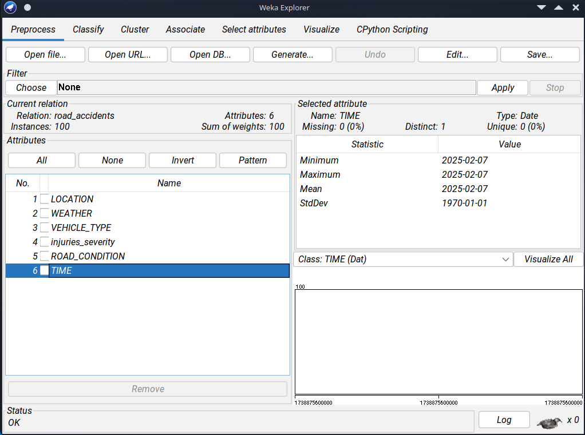
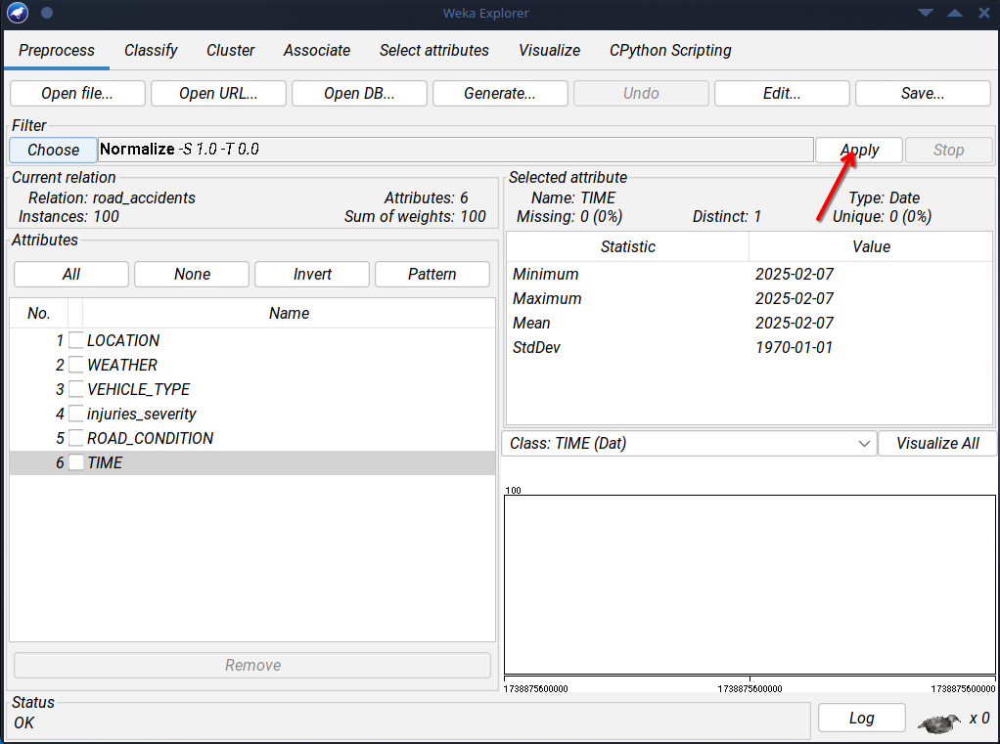
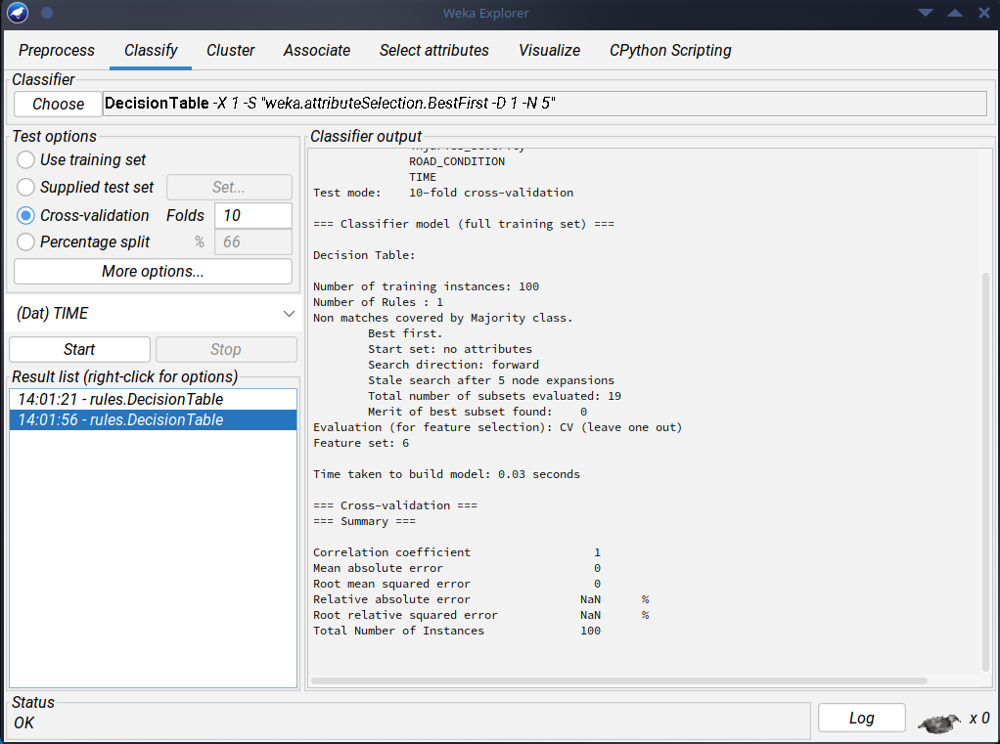
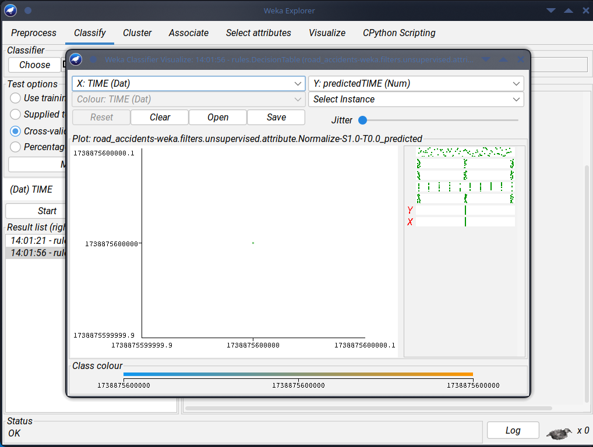

# Using weka for data mining

In this exercise where going to transform data that we collected from kaggle

we'll first convert it into a [.csv file](road_accident_dataset_1.csv)

After that we now have to make it weka friendly by changing the file extension to [.arff](accident.arff)

the file will look like this

 - load the dataset to the weka program

    
 - normalize the data to ensure that  the dataset has the same scale

     

the output of the first test 

the visual presentation

