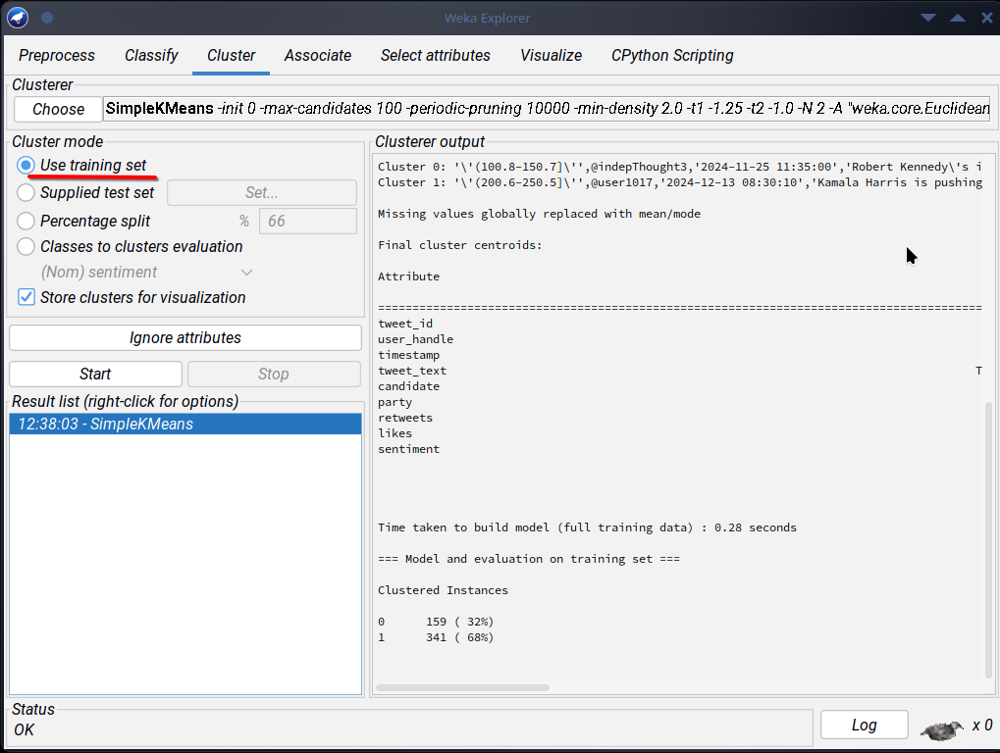

# Assignment 2

data

## loading the file

cleaning the file

- # Assosication mining

   ## the findings are:

  - Democratic party kamala Harris has a confidence score of (100%)
  - Everyone who mentioned Kamala Harris also expressed positive sentiment in their posts.
  - The lift value of 1.52 means this positive sentiment happens 52% more often than you would expect by random chance — suggesting a meaningful connection.
  - Every post mentioning the Republican Party also mentioned Donald Trump.
  - All mentions of Jill Stein included the Green Party.
  - Every post about Independent candidates also mentioned Robert Kennedy.

## patterns detected

- Highly active supporters: Kamala Harris seems to have strong, positive support, given the "positive sentiment" rule.
- Silent but engaged users: No direct evidence, but we might infer this from candidates without a linked sentiment (like Robert Kennedy).
- Negative influencers: No strong negative sentiment rules appeared, suggesting fewer explicit negative sentiments in the dataset.

 # The cluster analysis using simpleKMeans

  cluster image
  
  
   
   clustering using percentage split
  

clustering using training set
  

   - clusters created
      
      - Cluster 0 32% of instances
      - Cluster1 68% of instance
  - centroid insights
      
      - Cluster 0: Higher engagement metrics (likes/retweets closer to upper bounds). This could represent highly active supporters.
      - Cluster 1: Lower engagement, possibly silent but engaged users.

## conclusion

 Confidence: All rules show high confidence (100%).
 **Lift:** The Kamala Harris -> Positive sentiment rule shows a lift of 1.52 — meaning positive sentiment is more likely than random chance for her supporters.